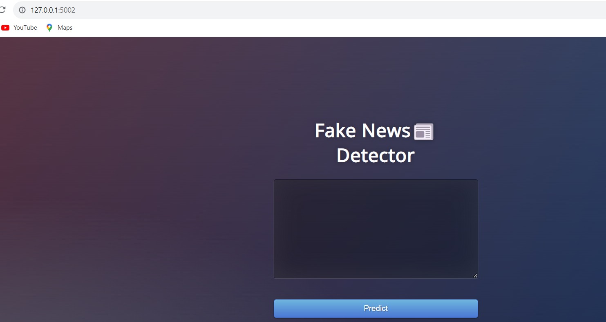

# Deceptive news sequencing using LSTM

This project uses Long Short-Term Memory (LSTM) networks within the domains of Machine Learning and NLP to detect deceptive elements in news articles. With the rise of misinformation across digital platforms, the need for reliable methods to verify content accuracy has never been more pressing. Our model aims to provide a solution that aids researchers, journalists, and tech enthusiasts in identifying deceptive content patterns in news articles, making it easier to navigate misinformation and promote an informed digital space.


# 📜 To refer to original research paper 
For more technical insights and background, refer to the original research: Exploring Deceptive News Sequencing Using LSTM
[Link for research paper](https://onlinelibrary.wiley.com/doi/abs/10.1002/ett.3767)


## 📁 Dataset
The project uses the Kaggle Fake News dataset for training and testing: Fake News Data on Kaggle
This dataset contains various features including the article title, text, and labels that classify the news as reliable or deceptive, aiding in training the model to differentiate between true and false news.

https://www.kaggle.com/c/fake-news/data

## 🔧 Dependencies
Ensure the following dependencies are installed:

1.TensorFlow: Deep learning framework
2.Keras: Simplifies building neural networks
3.Scikit-Learn: For ensemble learning methods and model evaluation
4.NLTK Toolkit: For text preprocessing and tokenization
5.Jupyter Notebook/Google Colab: Execution and code demonstration platforms
6.Data Manipulation & Visualization: Matplotlib, NumPy, Pandas

```bash
pip install tensorflow keras scikit-learn nltk matplotlib numpy pandas
```
  
## 🚀 Project Setup and Execution

-Clone the repository or copy the .py files to your project directory.
-Install dependencies using the command above.
-Run the project using Jupyter Notebook or Google Colab:

## Instructions to Run:
### Jupyter Notebook
Open your terminal and execute the following commands:
```bash
cd ~/Desktop/"Your Project Directory"
conda activate "Your Environment"
jupyter notebook
```
### Google Colab
Upload the .py or notebook file directly into Google Colab and run the code block by block.
[Link for Google Colab](https://colab.research.google.com/)
    
## 🖥 Tech Stack

**Frameworks:** TensorFlow, Keras

**Model Architecture:** Long Short-Term Memory (LSTM) Networks, Artificial Neural Networks (ANN)

**Text Preprocessing:** NLTK

**Python Libraries:** Numpy, Pandas

**Ensemble Learning:** Scikit-learn

**Platform:** Google Colab/ Jupyter Notebook


## 🔍 Step-by-Step Process
Here’s a complete breakdown of the project flow:

#### 1. Data Collection and Loading
-Download: Download the dataset from Kaggle.
-Load: Load the dataset into a Pandas DataFrame using pd.read_csv() to facilitate data manipulation.
#### 2. Data Preprocessing
-Cleaning: Remove unwanted characters, punctuation, and stop words using NLTK’s stopwords list.
-Tokenization: Split the text into individual tokens (words) to prepare for embedding.
-Stemming/Lemmatization: Use NLTK to convert words to their root forms, reducing vocabulary size without losing meaning.
-Vectorization: Transform the cleaned text into numerical vectors. We use word embeddings (e.g., Word2Vec or GloVe) for contextual representation.
#### 3. Model Selection and Architecture
-Embedding Layer: The first layer of the LSTM network, which converts tokens into dense vectors.
-LSTM Layers: These capture sequential patterns and dependencies, crucial for detecting subtle changes that indicate deceptive content.
-Dense Layers: Used to condense information for final classification.
-Output Layer: A softmax layer for multi-class classification (true vs. deceptive).
#### 4. Train-Test Split
-Data Split: Split the dataset into training and test sets (typically an 80-20 split).
-Batching: Configure batches for efficient processing during training.
#### 5. Model Training
-Compilation: Compile the model with a suitable loss function (e.g., categorical cross-entropy) and optimizer (e.g., Adam).
-Training: Train the model on the dataset, using validation data to assess performance after each epoch.
-Monitoring: Plot loss and accuracy over epochs to monitor convergence and adjust if necessary.
#### 6. Evaluation
-Confusion Matrix: Provides a breakdown of correctly and incorrectly classified instances.
-Accuracy, Precision, Recall, F1-Score: Measure the model's ability to accurately classify deceptive news.
-ROC Curve: To visualize model performance across various threshold settings.
#### 7. Prediction and Testing
-Test Data Evaluation: Use unseen data to evaluate the model's generalization capability.
-Ensemble Learning: Apply methods like majority voting to improve stability and reliability in predictions.
#### 8. Visualization and Results
-Confusion Matrix Visualization: Visualize model predictions versus actual classifications.
-Metrics Summary: Summarize precision, recall, F1 score, and accuracy.
-Plots: Plot training vs. validation accuracy/loss to assess model performance over epochs.
#### 9. Model Saving and Deployment
-Save Model: Save the trained model to a file (.h5 or .pb) for future use.
-Load Model: Demonstrate how to load the saved model and use it for new predictions.

## 📊 Results and Evaluation Metrics
The model has been evaluated using the following metrics:
**Confusion Matrix**: Visualizes classification performance by comparing actual vs. predicted labels.
**Precision, Recall, and F1 Score**: Assess the model's ability to accurately identify deceptive news.
**Accuracy**: Shows overall correct classifications.


## Example Output


## 📜 License
[MIT](https://choosealicense.com/licenses/mit/)


## 🤖 About Me :
I'm Srijayanth Potluri, an aspiring data analyst with a passion for machine learning, deep learning, and NLP technologies. This project represents my interest in combating misinformation and leveraging advanced algorithms for meaningful applications.

## 🔗 Links

[](https://www.linkedin.com/in/srijayanth-potluri-437519259/)
[](https://twitter.com/SrijayanthP)

